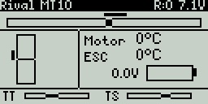

# EdgeTX Telemetry Dashboard for RadioMaster MT12 (Rival MT10)

A customer EdgeTX Lua telemetry dashboard script designed for the **RadioMaster MT12** transmitter.

It provides real-time visual telemetry, signal quality indicators, battery status, and control overlays directly on the MT12's 128x64 LCD screen.

## 📋 Features

- **Real-Time Temperature & Voltage Monitoring**:
  - Displays motor temperature (from sensor `Tmp1`) and ESC temperature (from sensor `EscT`) in Celsius.
  - Displays main vehicle battery voltage (from sensor `EscV`).
- **Smart LiPo Battery Tracking**:
  - Employs an **Exponential Moving Average (EMA)** filter to smooth out sudden voltage sags and spikes under hard acceleration.
  - Calculates and shows remaining capacity via a custom 7-point 3S LiPo discharge curve.
  - Visual battery graphic indicating capacity blocks.
- **Controls & Inputs Overlay**:
  - **Steering**: A horizontal center bar representing steering channel (`ch1`) input, with a top marker representing the potentiometer `S2` position.
  - **Throttle/Brake**: A vertical center bar representing throttle channel (`ch2`) input, with a side marker representing the potentiometer `S1` position.
- **Trim Dashboards**:
  - Live horizontal gauges at the bottom showing Steering Trim (TS) and Throttle Trim (TT).
- **Core Signal & Transmitter Stats**:
  - Automatically resolves signal strength/quality sensor (e.g., RSSI, 1RSS, RQly, etc.) and displays it on the header.
  - Monitors and displays transmitter voltage (tx-voltage) and the active model name.
  - Displays the active **Drive Mode** (e.g., `HighEx`, `MidEx`, or `Full`, configured as flight modes and controlled via the `SA` switch) in the dead center of the header bar.

## 🛠️ Hardware Requirements & Setup

This script is configured specifically for the following setup that I have ended up with:

- **Transmitter**: [RadioMaster MT12](https://www.radiomasterrc.com/products/mt12-surface-radio-controller) running EdgeTX (or compatible OpenTX).
- **ESC**: Hobbywing EZRUN MAX10 G2 (140A) (Part No: 30102603).
- **Motor**: Hobbywing EZRUN 3665 G3 (3200kv) (Part No: 38020344).
- **Telemetry Link**: Hobbywing Telemetry Adapter (Part No: 30850503)
- **Receiver**: FrSky Archer Plus R6
- **Extra temp sensor**: FrSky Temperature Sensor TEMS-01
- **Telemetry adapter for the TEMS-01**: SPortBUS Dual Temperature Telemetry Sensor for FrSky FBUS & S.Port

### Telemetry Sensor Configurations

You might need to change the following sensor names. See what you have registered in EdgeTX.

- **`Tmp1`**: Motor Temperature
- **`EscT`**: ESC Temperature
- **`EscV`**: For main battery voltage

## 🚀 Installation & Usage

1. **Copy the Script**: Transfer the `mk_birdy_display.lua` file to your RadioMaster MT12's SD Card in the `/SCRIPTS/TELEMETRY/` directory.
2. **Assign Telemetry Screen**:
   - On the MT12, press and hold the **SYS** or **MDL** button (depending on firmware version) to access the **Model Settings**.
   - Navigate to the **Telemetry** screen settings.
   - Configure a telemetry screen (e.g., Screen 1) to use the `Script` option and select `mk_birdy_display` (or `mk_birdy`).
3. **Access Dashboard**:
   - From the main home screen, long-press the **PAGE** button (or navigation wheel) to view your custom telemetry screens.
